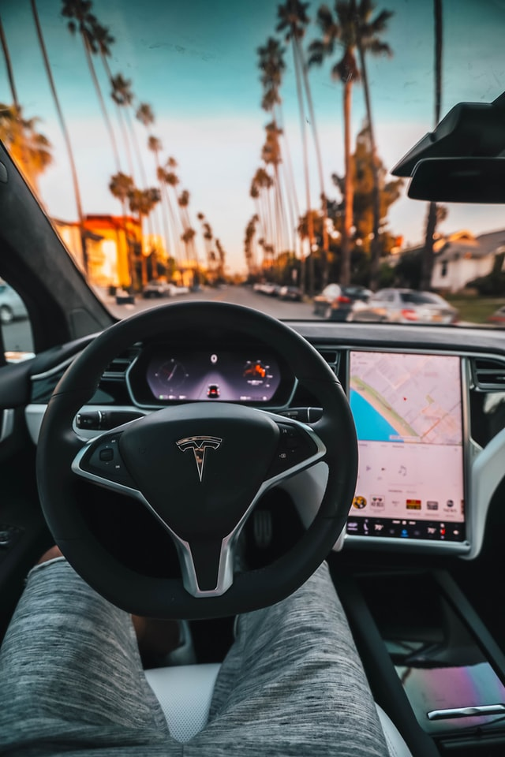

# Shreyas P J
*An Aspiring Data Scientist | 2X Kaggle Expert*

# Education
* Bachelors of Technology (Infformation Technology), *International Institute of Information Technology, Bhubaneswar*, 2019-2023.
* Pre-University College (Electronics), *VVS Sardar Patel Pre-University College, Bengaluru*, 2017-2019.
* School (ICSE), *The New Cambridge High School, Bengaluru*, 2007-2017.

# [Emotion Based Music Recommender System](https://github.com/shreyaspj20/Music-recommendation-system)

In this project, we propose a new approach to song recommendation, where in the mood of a person is determined from his picture and based on the mood predicted song recommendations are made that best suit the mood predicted.
* **Python libraries used:** OpenCV, Tensorflow and Keras, Sklearn, LightGBM, Spotipy, Tkinter, Pillow
* **Input:** Camera photo in real time
* **Output:** List of 10 recommended songs.

# [Project 2: Autonomous Driving Car simulation](https://github.com/shreyaspj20/Autonomous-Driving-Car-simulation-using-Pytorch)

In this project, we will be using camera sensors(center,left and right) implanted on the car to make predictions on the steering angle.This steering angle will be used to control the car. We will start of with building a model with the architecture which is defined in the NVIDIA reasearch paper https://arxiv.org/pdf/1604.07316v1.pdf. 
* **Python libraries used:** OpenCV, Torch, Torchvision, Socketio, Pillow.
* **Input:** Training images generated from UNITY simulator.
* **Output:** Autonomous Driving Car.

